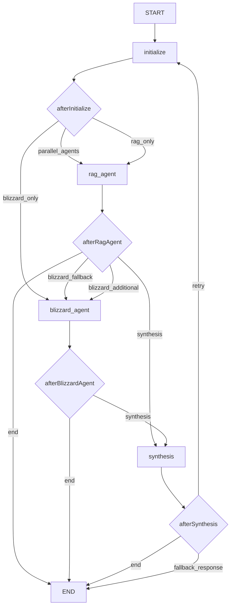

# LangGraph Workflow - WoW RAG API

Este directorio contiene la implementación del workflow de LangGraph para orquestar múltiples agentes en el sistema RAG de World of Warcraft.

## Arquitectura

El workflow de LangGraph está compuesto por:

### Nodos (Nodes)
- **initialize**: Valida la entrada y prepara el estado inicial
- **rag_agent**: Procesa consultas usando la base de conocimiento
- **blizzard_agent**: Obtiene datos en tiempo real de la API de Blizzard
- **synthesis**: Combina resultados de múltiples agentes

### Aristas (Edges)
- **afterInitialize**: Determina el siguiente paso después de la inicialización
- **afterRagAgent**: Decide si usar Blizzard como respaldo o contexto adicional
- **afterBlizzardAgent**: Siempre va a síntesis después de Blizzard
- **afterSynthesis**: Finaliza o maneja errores

### Flujo de Trabajo



## Características

### Ejecución Paralela
- Los agentes RAG y Blizzard pueden ejecutarse en paralelo cuando es apropiado
- Mejora el rendimiento y proporciona respuestas más completas

### Manejo de Errores
- Sistema de respaldo robusto con múltiples niveles
- Reintentos automáticos con límites configurables
- Fallback a sistema legacy si LangGraph falla

### Configuración Flexible
- Umbrales de confianza configurables
- Límites de iteración ajustables
- Timeouts personalizables

## Uso

### Desde el RAG Service
```typescript
const result = await this.langGraphWorkflow.execute(question, vectorStore);
```

### Ejecución Paralela
```typescript
const result = await this.langGraphWorkflow.executeParallel(question, vectorStore);
```

## LangGraph Studio

### Iniciar Studio
```bash
# Windows
./start-langgraph-studio.ps1

# Linux/Mac
./start-langgraph-studio.sh
```

### Acceder a la UI
- URL: http://localhost:8123
- Proyecto: wow-rag-workflow

### Características de Studio
- Visualización del workflow en tiempo real
- Debugging de nodos y aristas
- Monitoreo de ejecuciones
- Análisis de rendimiento

## Configuración

### Variables de Entorno
```bash
# LangGraph Studio
LANGGRAPH_STUDIO_PORT=8123
LANGGRAPH_PROJECT_NAME=wow-rag-workflow

# API Keys
LANGGRAPH_API_KEY=your_key_here
HUGGINGFACE_API_KEY=your_key_here
BLIZZARD_CLIENT_ID=your_client_id
BLIZZARD_CLIENT_SECRET=your_client_secret
```

### Configuración del Workflow
```typescript
const config: WorkflowConfig = {
  maxIterations: 3,
  enableBlizzardAgent: true,
  enableRagAgent: true,
  confidenceThreshold: 0.6,
  timeoutMs: 30000,
};
```

## Debugging

### Logs Detallados
- Cada nodo registra su estado y progreso
- Errores capturados con contexto completo
- Métricas de rendimiento incluidas

### Información del Agente
```typescript
const info = await ragService.getAgentInfo();
console.log(info.langgraph_workflow);
```

### Debug de Consultas
```typescript
const debug = await ragService.debugQuery(question);
console.log(debug);
```

## Beneficios de LangGraph

1. **Orquestación Inteligente**: Los agentes se ejecutan según las condiciones del estado
2. **Paralelización**: Múltiples agentes pueden trabajar simultáneamente
3. **Resiliencia**: Sistema robusto de manejo de errores y respaldos
4. **Observabilidad**: LangGraph Studio proporciona visibilidad completa
5. **Escalabilidad**: Fácil agregar nuevos nodos y aristas
6. **Mantenibilidad**: Código modular y bien estructurado

## Próximos Pasos

- [ ] Implementar más tipos de agentes especializados
- [ ] Agregar métricas de rendimiento avanzadas
- [ ] Implementar caching inteligente
- [ ] Agregar soporte para streaming de respuestas
- [ ] Integrar con sistemas de monitoreo externos


